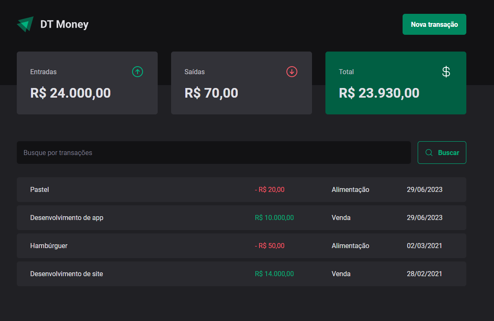

<h1 align="center">
  DT Money
</h1>

<h4 align="center">
  Aplicação de controle financeiro desenvolvida com React.js. Nela, o usuário consegue criar novas transações e buscar por transações passadas
</h4>

 

    

#

## 📚 Tecnologias
- React Hook Form
- Radix
- Styled Components
- Zod